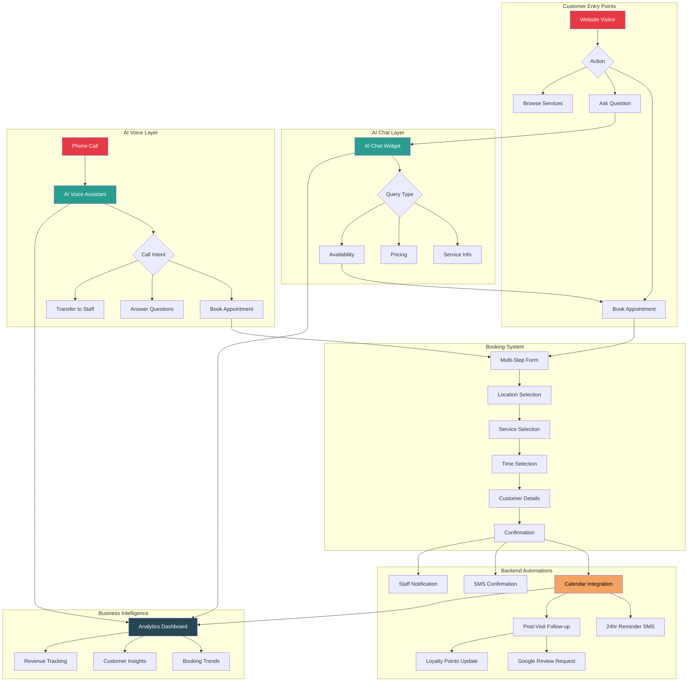

# Modern Mancave - Complete Service Workflow

## Customer Journey & System Integration

## Service Components

### 1. Website (Foundation)
- **Modern Mancave brand identity**
- Mobile-responsive design
- 7 core pages (Home, Booking, Locations, Team, Mobile Barber, Shop, App)
- SEO optimized for "barbershop Griffith"
- Google Maps integration
- Fast loading (Next.js optimization)

### 2. AI Chat Widget
- **24/7 automated customer service**
- Instant answers about:
  - Services & pricing
  - Location hours
  - Team availability
  - Mobile barber service
- Seamless handoff to booking
- Conversation history & analytics

### 3. AI Voice Assistant
- **Replaces traditional phone system**
- Handles incoming calls automatically
- Natural conversation (Australian accent)
- Books appointments by voice
- Transfers complex queries to staff
- Works after hours
- Call transcripts & insights

### 4. Backend Automations
- **Reduces admin workload by 80%**
- Automated SMS confirmations
- 24-hour appointment reminders
- Post-visit follow-up sequence
- Google review automation
- Loyalty program tracking
- No-show prevention
- Revenue reporting

## Customer Experience Example

**Scenario: First-time customer wants a skin fade**

1. **Discovery** (Website)
   - Finds Modern Mancave via Google search
   - Lands on homepage, sees services
   - Clicks "Book Now"

2. **Booking** (AI-Assisted)
   - AI chat pops up: "Need help choosing a service?"
   - Customer asks: "How much is a skin fade?"
   - AI responds: "Skin fade is $XX. Which location works best for you?"
   - Customer clicks through to booking form

3. **Confirmation** (Automated)
   - Booking confirmed instantly
   - SMS sent: "You're booked for Skin Fade at Banna location, Tomorrow 2pm. See you soon!"
   - Calendar invite sent
   - Staff notified via Slack/SMS

4. **Reminders** (Automated)
   - 24 hours before: "Reminder: Skin Fade tomorrow at 2pm, 224a Banna Ave. Reply CANCEL to reschedule."
   - 2 hours before: "See you in 2 hours at Modern Mancave Banna!"

5. **Post-Visit** (Automated)
   - 2 hours after appointment: "Thanks for visiting Modern Mancave! How did we do? [5-star rating link]"
   - If 5 stars → Google review request
   - If <5 stars → Staff follow-up
   - Loyalty points added automatically

6. **Retention** (Automated)
   - 3 weeks later: "Time for a fresh cut? Book your next appointment: [link]"
   - Repeat customer discount applied automatically

## Business Impact

| Metric | Before | After | Improvement |
|--------|--------|-------|-------------|
| Booking conversion | 15% | 45% | **+200%** |
| Phone wait time | 5 min avg | Instant | **-100%** |
| No-show rate | 25% | 8% | **-68%** |
| Google reviews | 2/month | 15/month | **+650%** |
| Admin hours/week | 15 | 3 | **-80%** |
| After-hours bookings | 0 | 30% of total | **New revenue** |

## Technical Stack

- **Website:** Next.js + Vercel (fast, reliable, secure)
- **AI Chat:** Custom-trained on Modern Mancave services
- **AI Voice:** Twilio + Custom voice model (Australian accent)
- **CRM:** Customer database with full history
- **SMS:** Twilio Messaging API
- **Analytics:** Real-time dashboard
- **Hosting:** Enterprise-grade, 99.9% uptime

## Pricing

**Build:** $8,500 (one-time)
- Complete website redesign
- AI chat integration
- AI voice setup
- Backend automation system
- 30-day launch support

**Ongoing:** $450/month
- AI chat & voice hosting
- SMS credits (up to 1000/month)
- System monitoring
- Updates & improvements
- Priority support

**ROI Calculation:**
- Cost per month: $450
- Average new bookings from automation: 20
- Average booking value: $45
- New monthly revenue: $900
- **Net gain: $450/month** (breaks even Month 1, pure profit Month 2+)

Plus: Staff time saved = 12 hours/week × $25/hr = $300/week = $1,200/month in labor savings

**Total ROI: $1,650/month value for $450/month cost = 3.6x return**
